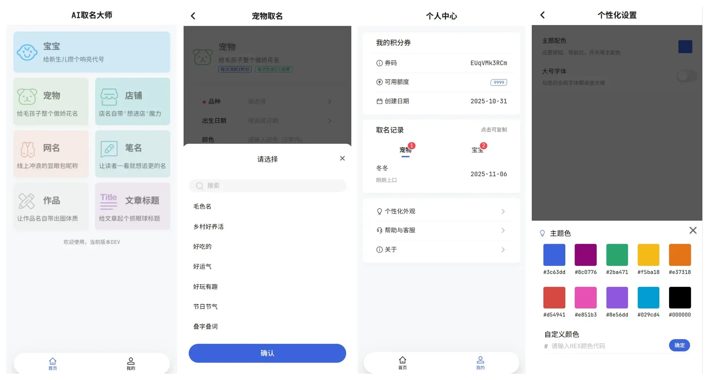
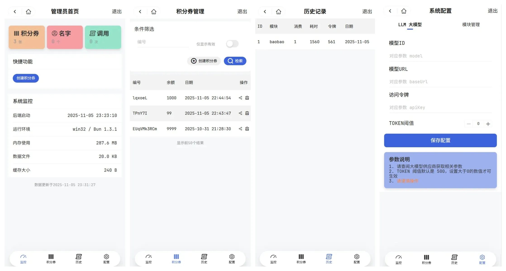

# AI取名大师

借助 豆包、通义千问、DeepSeek 等 AI 大模型，为您的宝宝、宠物、店铺、网名、笔名、项目、产品、服务等取一个专业、有意义的名字。 





---

## 二次开发
> 推荐使用[Bun.js](https://bun.com/)运行及部署

### 目录说明

* about：项目文档
* app：客户端代码（基于 [uni-app](https://uniapp.dcloud.net.cn/)）
* server：服务端代码（基于 [Elysia.js](https://elysiajs.com/)）

### 打包

#### 后端程序

```shell
# 使用 server/build.js 打包，提供更多的功能
bun serve:build

# 也可以使用命令行打包
bun build src/bun.js --cwd server --outfile dist/ai-naming.js --target=bun
```

#### 客户端

```shell
# 打包 H5
bun app:h5:build
```
